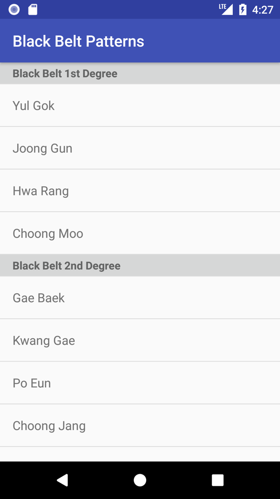

# Android Technical Challenge
Create an app that renders the content of the `playlist.yaml` file by using the following design:

Your solution must:

- Look as close to the design as you can make it; ensure you pay attention to detail
- Have code that you consider to be of production quality
- Use the `playlist.yaml` for the content of the app—you can embed the file as a resource, however, bonus points are awarded for getting the file from a remote location e.g. from this Git repository
- Render the entire list; the list is expected to scroll smoothly and efficiently 
- Support both portrait and landscape

If you have any questions, please use your ingenuity and experience to answer your own questions. Feel free to add comments explaining any decisions you've made that are note worthy in the code, alternatively you can add a README file with more details if you think it will help explain your solution design decisions.

Please submit your response to this challenge as a pull-request to this repository.